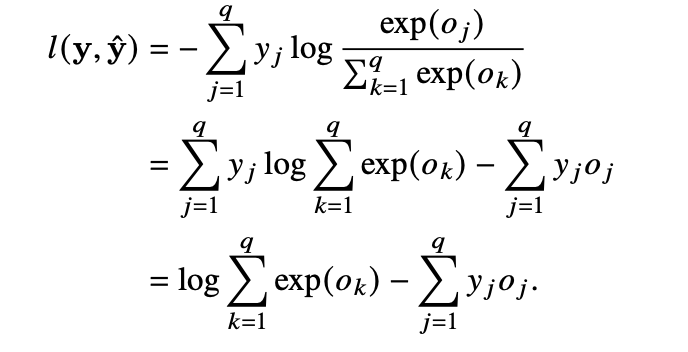
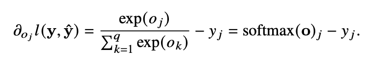

# 交叉熵损失函数（Cross Entropy Loss）

## 1 交叉熵（cross entropy）

### 1.1 事件包含的信息量
交叉熵是信息论中的概念。**事件包含的信息量应该与其发生的概率负相关**

假设X是一个离散型随机变量，它的取值集合为$ \left \{ x_{1}, x_{2},\cdots , x_{n} \right \} $，定义事件\(X=x_i\)的信息量为：$I(x_{i})=-\log P(X=x_{i})$在概率值P趋向于0时，信息量趋向于正无穷，在概率值P趋向于1时，信息量趋向于0

## 1.2 熵
我们可以用香农熵（简称熵）来对整个概率分布的平均信息量进行描述。具体方法为求上述信息量函数关于概率分布P的期望，这个期望值（即熵）为：
$H(X)=-\sum_{i=1}^{n}P(X=x_{i})\log P(X=x_{i})$

[交叉熵损失函数](https://blog.csdn.net/SongGu1996/article/details/99056721)

# Softmax and Cross-Entropy Loss

